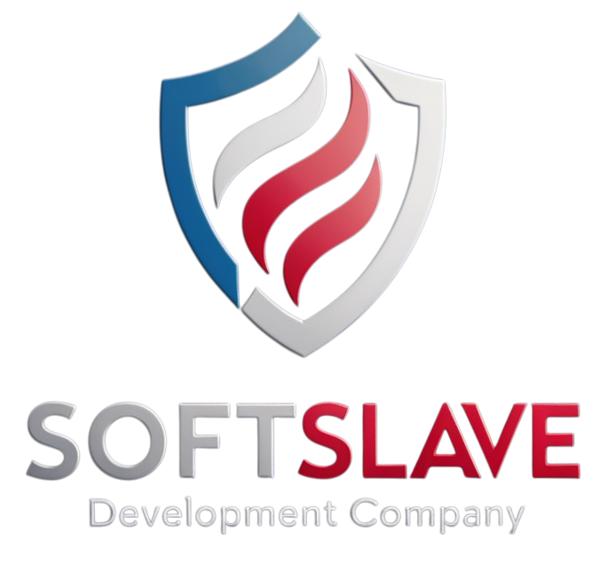

  
  

# API Node TypeScript

This is a simple API built with Node.js and TypeScript. It provides basic CRUD operations for managing a list of items.
## Features
- Create, Read, Update, and Delete items
- TypeScript for type safety
- Express.js for handling HTTP requests

## Installation

1. Clone the repository
2. Run `npm install` to install dependencies

## Scripts

- `npm run dev`: Start the development server with hot-reloading
- `npm run build`: Compile TypeScript to JavaScript
- `npm run start`: Start the production server

## Stay in touch

- Author - [John Rivas](https://www.linkedin.com/in/john-rivas-arteaga/)

**Disclaimer:**  
The Node.js® logo is used for informational purposes.  
Node.js® is a trademark of Joyent, Inc., and is used here in accordance with the [OpenJS Foundation Trademark Policy](https://openjsf.org/trademark-policy/).